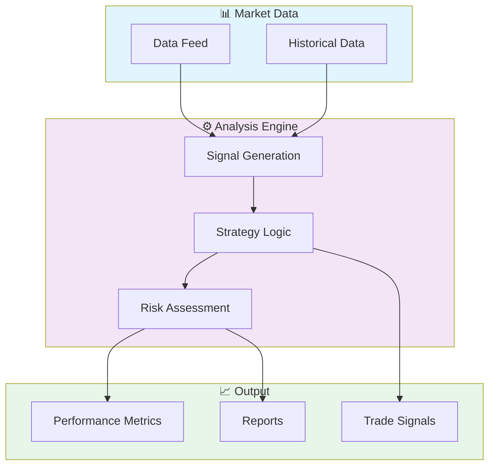
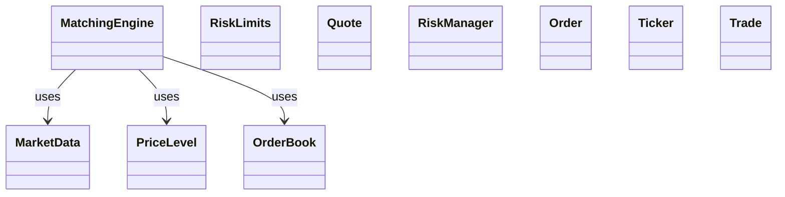

# 📈 Rust Hft Trading Engine

> High-Frequency Trading Engine in Rust with order matching, market data processing, and risk management

[](https://img.shields.io/badge/)
[](https://img.shields.io/badge/)
[](https://img.shields.io/badge/)
[](LICENSE)
[](Dockerfile)

[English](#english) | [Português](#português)

---

## English

### 🎯 Overview

**Rust Hft Trading Engine** is a production-grade Rust application that showcases modern software engineering practices including clean architecture, comprehensive testing, containerized deployment, and CI/CD readiness.

The codebase comprises **1,423 lines** of source code organized across **13 modules**, following industry best practices for maintainability, scalability, and code quality.

### ✨ Key Features

- **📈 Strategy Engine**: Multiple trading strategy implementations with configurable parameters
- **🔄 Backtesting Framework**: Historical data simulation with realistic market conditions
- **📊 Performance Analytics**: Sharpe ratio, Sortino ratio, maximum drawdown, and more
- **⚡ Real-time Processing**: Low-latency data processing optimized for market speed
- **🐳 Containerized**: Docker support for consistent deployment
- **🏗️ Object-Oriented**: 11 core classes with clean architecture

### 🏗️ Architecture





### 🚀 Quick Start

#### Prerequisites

- Rust 1.75+ (via [rustup](https://rustup.rs/))
- Cargo (included with Rust)

#### Installation

```bash
# Clone the repository
git clone https://github.com/galafis/rust-hft-trading-engine.git
cd rust-hft-trading-engine

# Build in release mode
cargo build --release
```

#### Running

```bash
# Run the application
cargo run --release

# Or run the binary directly
./target/release/rust_hft_trading_engine
```

### 📁 Project Structure

```
rust-hft-trading-engine/
├── benches/
│   └── order_matching.rs
├── examples/
│   └── advanced_trading.rs
├── src/          # Source code
│   ├── engine/
│   │   ├── matching_engine.rs
│   │   └── mod.rs
│   ├── models/        # Data models
│   │   ├── market_data.rs
│   │   ├── mod.rs
│   │   ├── order.rs
│   │   ├── orderbook.rs
│   │   └── trade.rs
│   ├── risk/
│   │   ├── mod.rs
│   │   └── risk_manager.rs
│   ├── lib.rs
│   └── main.rs
├── tests/         # Test suite
│   └── test_main.rs
├── Cargo.toml
├── Dockerfile
├── LICENSE
└── README.md
```

### 📊 Performance Metrics

The engine calculates comprehensive performance metrics:

| Metric | Description | Formula |
|--------|-------------|---------|
| **Sharpe Ratio** | Risk-adjusted return | (Rp - Rf) / σp |
| **Sortino Ratio** | Downside risk-adjusted return | (Rp - Rf) / σd |
| **Max Drawdown** | Maximum peak-to-trough decline | max(1 - Pt/Pmax) |
| **Win Rate** | Percentage of profitable trades | Wins / Total |
| **Profit Factor** | Gross profit / Gross loss | ΣProfit / ΣLoss |
| **Calmar Ratio** | Return / Max Drawdown | CAGR / MDD |
| **VaR (95%)** | Value at Risk | 5th percentile of returns |
| **Expected Shortfall** | Conditional VaR | E[R | R < VaR] |

### 🛠️ Tech Stack

| Technology | Description | Role |
|------------|-------------|------|
| **Rust** | Core Language | Primary |
| **Docker** | Containerization platform | Framework |
| **Tokio** | Async runtime for Rust | Framework |

### 🤝 Contributing

Contributions are welcome! Please feel free to submit a Pull Request. For major changes, please open an issue first to discuss what you would like to change.

1. Fork the project
2. Create your feature branch (`git checkout -b feature/AmazingFeature`)
3. Commit your changes (`git commit -m 'Add some AmazingFeature'`)
4. Push to the branch (`git push origin feature/AmazingFeature`)
5. Open a Pull Request

### 📄 License

This project is licensed under the MIT License - see the [LICENSE](LICENSE) file for details.

### 👤 Author

**Gabriel Demetrios Lafis**
- GitHub: [@galafis](https://github.com/galafis)
- LinkedIn: [Gabriel Demetrios Lafis](https://linkedin.com/in/gabriel-demetrios-lafis)

---

## Português

### 🎯 Visão Geral

**Rust Hft Trading Engine** é uma aplicação Rust de nível profissional que demonstra práticas modernas de engenharia de software, incluindo arquitetura limpa, testes abrangentes, implantação containerizada e prontidão para CI/CD.

A base de código compreende **1,423 linhas** de código-fonte organizadas em **13 módulos**, seguindo as melhores práticas do setor para manutenibilidade, escalabilidade e qualidade de código.

### ✨ Funcionalidades Principais

- **📈 Strategy Engine**: Multiple trading strategy implementations with configurable parameters
- **🔄 Backtesting Framework**: Historical data simulation with realistic market conditions
- **📊 Performance Analytics**: Sharpe ratio, Sortino ratio, maximum drawdown, and more
- **⚡ Real-time Processing**: Low-latency data processing optimized for market speed
- **🐳 Containerized**: Docker support for consistent deployment
- **🏗️ Object-Oriented**: 11 core classes with clean architecture

### 🏗️ Arquitetura


### 🚀 Início Rápido

#### Prerequisites

- Rust 1.75+ (via [rustup](https://rustup.rs/))
- Cargo (included with Rust)

#### Installation

```bash
# Clone the repository
git clone https://github.com/galafis/rust-hft-trading-engine.git
cd rust-hft-trading-engine

# Build in release mode
cargo build --release
```

#### Running

```bash
# Run the application
cargo run --release

# Or run the binary directly
./target/release/rust_hft_trading_engine
```

### 📁 Estrutura do Projeto

```
rust-hft-trading-engine/
├── benches/
│   └── order_matching.rs
├── examples/
│   └── advanced_trading.rs
├── src/          # Source code
│   ├── engine/
│   │   ├── matching_engine.rs
│   │   └── mod.rs
│   ├── models/        # Data models
│   │   ├── market_data.rs
│   │   ├── mod.rs
│   │   ├── order.rs
│   │   ├── orderbook.rs
│   │   └── trade.rs
│   ├── risk/
│   │   ├── mod.rs
│   │   └── risk_manager.rs
│   ├── lib.rs
│   └── main.rs
├── tests/         # Test suite
│   └── test_main.rs
├── Cargo.toml
├── Dockerfile
├── LICENSE
└── README.md
```

### 📊 Performance Metrics

The engine calculates comprehensive performance metrics:

| Metric | Description | Formula |
|--------|-------------|---------|
| **Sharpe Ratio** | Risk-adjusted return | (Rp - Rf) / σp |
| **Sortino Ratio** | Downside risk-adjusted return | (Rp - Rf) / σd |
| **Max Drawdown** | Maximum peak-to-trough decline | max(1 - Pt/Pmax) |
| **Win Rate** | Percentage of profitable trades | Wins / Total |
| **Profit Factor** | Gross profit / Gross loss | ΣProfit / ΣLoss |
| **Calmar Ratio** | Return / Max Drawdown | CAGR / MDD |
| **VaR (95%)** | Value at Risk | 5th percentile of returns |
| **Expected Shortfall** | Conditional VaR | E[R | R < VaR] |

### 🛠️ Stack Tecnológica

| Tecnologia | Descrição | Papel |
|------------|-----------|-------|
| **Rust** | Core Language | Primary |
| **Docker** | Containerization platform | Framework |
| **Tokio** | Async runtime for Rust | Framework |

### 🤝 Contribuindo

Contribuições são bem-vindas! Sinta-se à vontade para enviar um Pull Request.

### 📄 Licença

Este projeto está licenciado sob a Licença MIT - veja o arquivo [LICENSE](LICENSE) para detalhes.

### 👤 Autor

**Gabriel Demetrios Lafis**
- GitHub: [@galafis](https://github.com/galafis)
- LinkedIn: [Gabriel Demetrios Lafis](https://linkedin.com/in/gabriel-demetrios-lafis)
